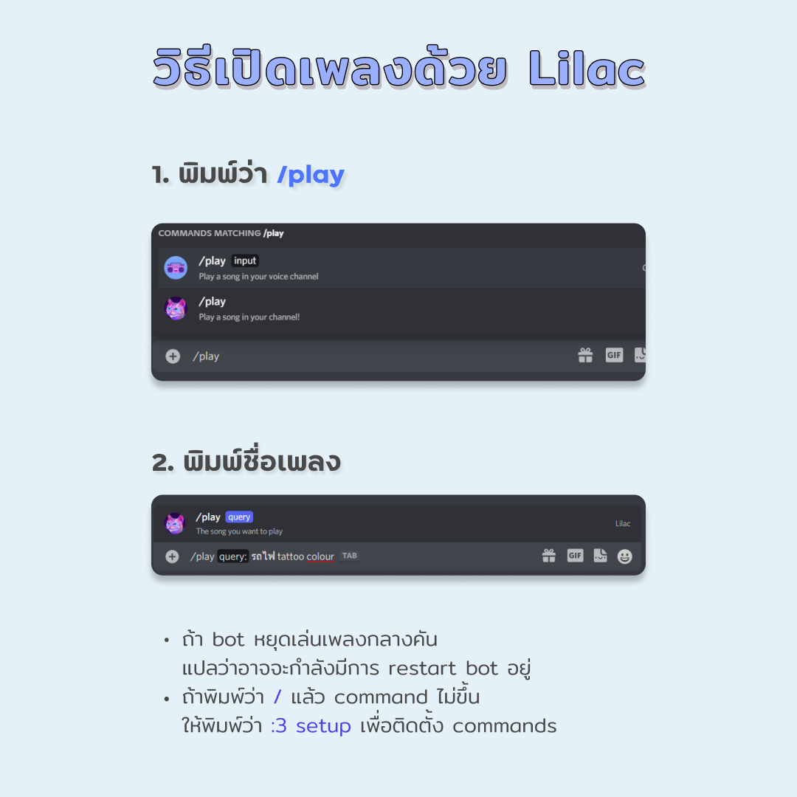

<h1 align="center">Lilac</h1>

<p align="center">A simple discord bot just for playing music.</p>



## Table of contents

* [Requirements](#requirements)
* [Getting started](#getting-started)
* [Common errors](#common-errors)
* [Contributing](#contributing)
* [License](#license)

## Requirements

- [Node.js](https://nodejs.org/en/) - Version 16 or higher
- [NPM](https://www.npmjs.com/)
- [FFMPEG](https://www.ffmpeg.org/)

## Getting started

First, make sure you have all the required tools installed on your local machine then continue with these steps.

### Installation

```bash
# Clone the repository
git clone https://github.com/betich/lilac.git

# Enter into the directory
cd lilac/

# Install the dependencies
npm install # npm
yarn install # yarn
```

## Required permissions

**Important:** Make sure that your bot has the `applications.commands` application scope enabled, which can be found under the `OAuth2` tap on the [developer portal](https://discord.com/developers/applications/)

### Configuration

After cloning the project and installing all dependencies, you need to add your Discord API token in the config.json file.

### Starting the application

```bash
node index.js
```

### Starting the application using Docker

```bash
# Build the image
docker build --tag lilac .

# Run the image
docker run -d lilac
```

## Features & Commands

`/play YOUTUBE_URL`

* 🎶 Play music from YouTube via url

`/play SONG_NAME`

* 🎶 Play music from using song name

`/pause`

* 📃 Pause music

`/resume`

* 🎓 Resume music

`/skip`

* 💿 Skip song

`/stop`

* 🔇 Stop music

`/nowplaying`

* ▶ Now Playing

`/purge`

* 🚮 Delete the latest chat messages

## Common errors

Here is a list of common errors and how you can fix them.

### Dependencies aren't up to date

The packages used in this repository get updated often, especially the ytdl-core package. That is why it is always worth a try updating those if you get an error like `invalid URL: undefined` or when the bot crashes when running the play command.

```bash
npm install ytdl-core@latest
```

### FFMPEG is not installed on the machine running the bot

The `play` command requires FFMPEG to be installed on the machine that is running the bot. You can download it on the official [FFMPEG website](https://www.ffmpeg.org/). Note: This isn't relevant if you use the Dockerfile because it will install FFMPEG inside of the container.

## Contributing

You are welcome to contribute by submitting a Pull Request to the repository. 🤍

## License

This project is licensed under the MIT License - see the [LICENSE.md](LICENSE) file for details

## Credit

This bot is a fork of [this music bot](https://github.com/TannerGabriel/discord-bot).

### Libraries

* [discord.js](https://www.npmjs.com/package/discord.js)
* [discord-player](https://www.npmjs.com/package/discord-player)
* [ytdl](https://www.npmjs.com/package/ytdl-core)
* [ffmpeg](https://www.ffmpeg.org/)

<p align="center">Made with 🤍 by betich</p>